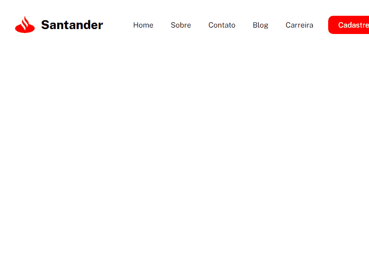

# Desafio - Flexbox Layout Menu Bank 🏛
<a href="https://msumii.github.io/desafio-html-css-flexbox-menu-bank/"></a>

### Clique no GIF para abrir o site👆

## Por que fiz esse projeto? 🤔

Nesses últimos dias entre 23 de Janeiro até hoje dia 25 de Janeiro, comecei a estudar o Flexbox do CSS, queria por em prática o que eu aprendi desse conceito, fazendo assim um layout de um menu, baseado no banco Santander sendo ele feito apenas com Flexbox e deixando ele responsivo com uma versão para dispositivos móveis.

## Quais as propriedades que eu utilizei do Flexbox? 🖥

As propriedades que eu mais utilizei foram:

```CSS
   display: flex;
```
Para conseguir trabalhar com o Flexbox, devemos mudar o display para flex.

```CSS
   justify-content: space-between;
```
Para distruibuir os elementos do menu deixa o logo no começo e a navegação do final.

```CSS
   align-items: center;
```
Para alinhar os elementos no centro do eixo vertical.

## Como utilizar? 😊

Diminua a largura do site, assim você iria conseguir ver o responsivo sendo aplicado, deixando o site em um formato diferente próprio para dispostivos móveis. 👍

OBS: Caso esteja pelo celular, deixe seu navegador no modo Para Computador que irá conseguir ver como o site é em telas maiores.

## Tecnologias Utilizadas 💻

  - HTML
  - CSS
  - Git
  
## Conclusão 😉

Após usar o Flexbox, tudo se tornou mais fácil quem quesito organização, assim em projetos futuros, eu irei utilizar ele com frequência deixando assim, meus projetos cada vez melhores e fáceis de serem manuseados.